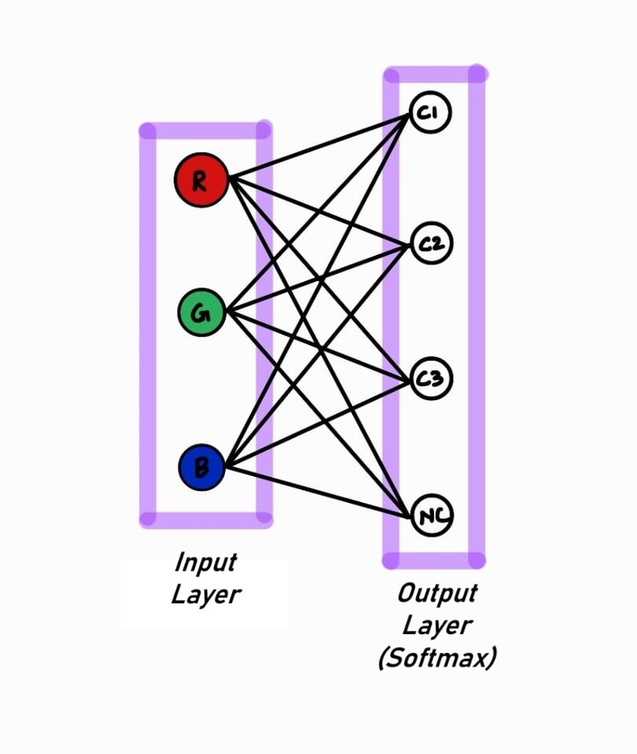

# ColorCubeSortingRobot

In this project, cubes were classified based on color using a color sensor, then transported and sorted using a conveyor belt and a 4DOF robotic arm. For seamless coordination and reduced complexity, the Propeller Activity Board was used, leveraging its multiprocessing capability.

  

## Components Used
- **Stepper Motor** - For precise continuous motion and sudden start/stop of the conveyor belt.
- **DRV8825 Motor Driver** - For controlling the stepper motor via the Propeller.
- **TCS3200 Color Sensor** - For sensing the color of the cubes.
- **MG90S Servo Motors** - For actuating robotic arm joints.
- **HCSR-04 Ultrasonic Sensor** - For detecting cubes reaching the end of the conveyor belt.
- **Propeller Activity Board** - For running the program and controlling all the components.
- **12V SMPS** - For powering all the components.

## Color Detection
The TCS3200 outputs three values that correspond to the Red, Green, and Blue components of the detected color. These values were highly dependent on the lighting conditions; hence, an enclosure with a black chart interior was made on top 
of the part of the conveyor where color sensing is done. The LEDs on the color sensor were used to produce a controlled lighting environment.
It was observed that for the particular sensor used, the R, G, and B components were not equally sensitive even in controlled lighting conditions, and thus needed some tedious calibration for reliable color classification by thresholding. To overcome this, softmax regression was performed with the R, G, and B values as inputs. To simplify regression model training, Keras was used to build a 2-layer (input and output layers) neural network, with softmax activation for output nodes. The input layer consisted of 3 nodes corresponding to the R, G, and B values (normalized for faster convergence), and the output layer consisted of 4 nodes corresponding to Red, Green, Blue cubes, and the no cube scenario.

  

Training data was collected for each cube by placing the cube on the conveyor belt and moving the belt back and forth such that the cube always stayed in the field of view of the sensor, for a fixed duration of 1 minute, producing a balanced dataset. The network parameters obtained were used to perform softmax regression in the Propeller Activity Board for real-time classification.

For robust detection, a mode filter was used on three continuous outputs of the softmax regression, taking the most frequent output as the final output. For example, outputs (nil, nil, red) will be taken as a no-cube scenario and outputs (red, red, nil) will be taken as a red cube.

## Multiprocessing with Propeller
For parallel and coordinated actions of the conveyor, color sensor, and the robotic arm, each cog of the Activity Board was dedicated to different parallel tasks, and coordination was achieved through global variables in the shared memory. Task allocation among different cogs is detailed below:
- **Cog 0** - For initializing global variables and other cogs.
- **Cog 1** - For acquiring ultrasonic sensor measurements for detecting cubes for pick and place.
- **Cog 2** - For acquiring color sensor readings and performing color classification.
- **Cog 3** - For controlling the robotic arm for performing pick and place.
- **Cog 4** - For controlling the conveyor motion.
- **Cog 5** - For keeping track of the conveyor's travel distance (to distinguish identical cubes with no gap).

## Coordinating Color Detection and Sorting
Color detection is performed near the front end of the conveyor, and sorting is performed at the rear end. To coordinate these tasks, an array was created in the shared memory, which keeps the list of classified cubes in the conveyor. This array is referred to by the sorting cog (cog 3) for sorting appropriately.

## Identical Cubes with No Gap (Scenario)
With the logic of identifying a cube of a particular color as a single cube until the softmax regression gives a different output, two or more cubes of the same color close enough to be identified as a single cube would result in wrong sorting of the following cubes. To eliminate this, the detection time period (in ms) by the color sensor for a single moving cube is recorded. A cog is dedicated (cog 5 as mentioned above) to act as a clockwork for the conveyor, ticking only when the conveyor moves. This cog-tick is then referred to by the classification cog (cog 2) to identify cubes with less gap.

## Results and Conclusion
Rigorous testing showed promising results, with the cubes being sorted swiftly and accurately. This project can be improved to produce robust, employable industrial sorting systems.
